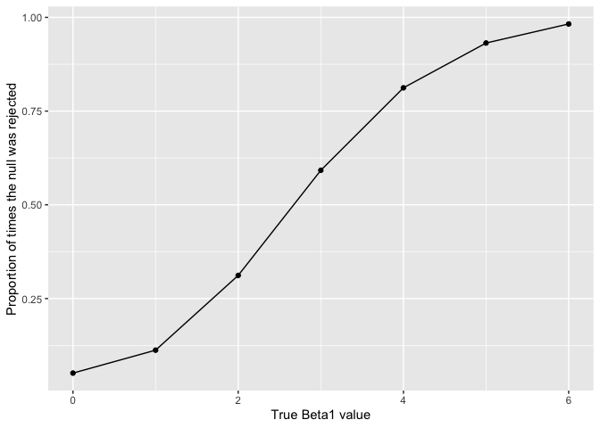

p8105\_hw5
================
Hao Sun
11/1/2019

## Problem 1

The code chunk below loads the iris dataset from the tidyverse package
and introduces some missing values in each column. The purpose of this
problem is to fill in those missing values.

``` r
set.seed(10)
iris_with_missing = iris %>% 
  map_df(~replace(.x, sample(1:150, 20), NA)) %>%
  mutate(Species = as.character(Species))
```

There are two cases to address:

For numeric variables, you should fill in missing values with the mean
of non-missing values For character variables, you should fill in
missing values with “virginica” Write a function that takes a vector as
an argument; replaces missing values using the rules defined above; and
returns the resulting vector. Apply this function to the columns of
iris\_with\_missing using a map statement.

**Answer**

``` r
fill_NA = function(vector){
   if (class(vector) == "numeric") {
     ###missing values as the mean of non-missing values 
  coalesce(vector,round(mean(vector[!is.na(vector)]),digit = 1))
  }

  else if (class(vector) == "character") {
  #### fill in missing values with "virginica" 
    coalesce(vector,"virginica")
  }
  else 
 stop("Input shall be either numeric or character vector")
}

##Do everything across column and merge the output into dataset.
iris_without_missing<-map_df(iris_with_missing,fill_NA)

iris_without_missing
```

    ## # A tibble: 150 x 5
    ##    Sepal.Length Sepal.Width Petal.Length Petal.Width Species
    ##           <dbl>       <dbl>        <dbl>       <dbl> <chr>  
    ##  1          5.1         3.5          1.4         0.2 setosa 
    ##  2          4.9         3            1.4         0.2 setosa 
    ##  3          4.7         3.2          1.3         0.2 setosa 
    ##  4          4.6         3.1          1.5         1.2 setosa 
    ##  5          5           3.6          1.4         0.2 setosa 
    ##  6          5.4         3.9          1.7         0.4 setosa 
    ##  7          5.8         3.4          1.4         0.3 setosa 
    ##  8          5           3.4          1.5         0.2 setosa 
    ##  9          4.4         2.9          1.4         0.2 setosa 
    ## 10          4.9         3.1          3.8         0.1 setosa 
    ## # … with 140 more rows

## Problem 2

This zip file contains data from a longitudinal study that included a
control arm and an experimental arm. Data for each participant is
included in a separate file, and file names include the subject ID and
arm.

Create a tidy dataframe containing data from all participants, including
the subject ID, arm, and observations over time:

Start with a dataframe containing all file names; the list.files
function will help

Iterate over file names and read in data for each subject using
purrr::map and saving the result as a new variable in the dataframe Tidy
the result; manipulate file names to include control arm and subject ID,
make sure weekly observations are “tidy”, and do any other tidying
that’s necessary Make a spaghetti plot showing observations on each
subject over time, and comment on differences between groups.

**Answer**

``` r
##Function definition:
read_and_label<-function(filename){
   if (class(filename) == "character") {
     ##change file name into path
     path = str_c("./data/",filename)
     ##lable each entries with file name
     read_csv(path)%>%mutate(arm_id = str_replace(filename,".csv", " "))
  }
  else 
 stop("Input shall be character")
}

file_list<-list.files("./data")

weekly_obs<-map_df(file_list,read_and_label)%>%
  ##Change file name into id and control arm
  separate(arm_id, into = c("arm", "subject_id"), sep = "_") %>%
  ##tidy the data
  pivot_longer(names_to = "weeks", values_to = "obs", cols = week_1:week_8 )%>%
  mutate(arm = as.factor(arm), weeks = as.factor(weeks))

##Plot the data
weekly_obs%>%
  ##Geom line only work for continous data
  ggplot(aes(x = as.numeric(weeks),y = obs,color = subject_id))+
  geom_line()+
  facet_grid(. ~ arm)+
  labs(x = "number of weeks",
       y = "Observation")
```

<!-- -->

## Problem 3

When designing an experiment or analysis, a common question is whether
it is likely that a true effect will be detected – put differently,
whether a false null hypothesis will be rejected. The probability that a
false null hypothesis is rejected is referred to as power, and it
depends on several factors, including: the sample size; the effect size;
and the error variance. In this problem, you will conduct a simulation
to explore power in a simple linear regression. Fix n=30 Fix xi1 as
draws from a standard Normal distribution Fix β0=2 Fix σ2=50

``` r
##Define function: Beta1 generation
beta_generation= function(n =30, beta0 = 2, beta1 = 0) {
  
  sim_data = tibble(
    x = rnorm(n, mean = 0, sd = 1),
    ##Sigma^2 for ϵ is 50
    y = beta0 + beta1 * x + rnorm(n, 0, 50)
  )
  ##Tidy the lm output
  ls_fit = lm(y ~ x, data = sim_data)%>%broom::tidy()
  
  
  tibble(
    beta1_hat = ls_fit[[2,2]],
    p_value = ls_fit[[2,5]] 
  )
}


##Define function: reg_sim to test a array of beta1
reg_sim = function(beta1_val){
  if(is.numeric(beta1_val) == TRUE){
  rerun(10000, beta_generation(beta1 = beta1_val))%>%bind_rows()
  }
  else 
 stop("Input shall be number")
}
```

For each dataset, save β̂1 and the p-value arising from a test of H:β1=0
using α=0.05 . Hint: to obtain the estimate and p-value, use broom::tidy
to clean the output of lm.

``` r
##Sim for beta1 = 0
sim_results_0 = 
  rerun(10000, beta_generation())%>%bind_rows()
```

Repeat the above for β1={1,2,3,4,5,6} , and complete the following:

``` r
##Sim for beta1 from 0 to 6 and save in one tibble
beta_1_sim<-tibble(
beta_1_val = seq(0,6,1))%>%
  mutate(
beta_1_est = map(as.list(beta_1_val),reg_sim)
)
```

Make a plot showing the proportion of times the null was rejected (the
power of the test) on the y axis and the true value of β2 on the x axis.
Describe the association between effect size and power.

``` r
##find proportion of times the null was rejected for each beta_1
beta_1_sim<-beta_1_sim%>%
  mutate(
    ##For each dataset in the listcon, check how many of them have p value < 0.05
    null_rej_porp = map_dbl(beta_1_est,.%>%filter(p_value < 0.05)%>%nrow()),
    ##changes it into the propotions
    null_rej_porp = null_rej_porp/10000
    )

beta_1_sim%>% 
ggplot(aes(x = beta_1_val,y = null_rej_porp))+
  geom_point()+geom_line()+
  labs(x = "True Beta1 value",
       y = "Proportion of times the null was rejected")
```

<!-- -->

Make a plot showing the average estimate of β̂1 on the y axis and the
true value of β1 on the x axis. Make a second plot (or overlay on the
first) the average estimate of β̂1 only in samples for which the null
was rejected on the y axis and the true value of β1 on the x axis.

``` r
##find average estimate of beta_hat_1
beta_1_sim<-beta_1_sim%>%
  mutate(
    ##For each dataset in the listcon, find the mean of the beta1_hat
    average_beta_est = map_dbl(beta_1_est,.%>%pull(beta1_hat)%>%mean()),
    ##For each dataset in the listcon, find the mean of the beta1_hat with pvalue < 0.05
    average_beta_est_nrej = map_dbl(beta_1_est,.%>%filter(p_value < 0.05)%>%pull(beta1_hat)%>%mean()))%>%
  ##Tidy up the output
  mutate(raw = average_beta_est,null_rejected = average_beta_est_nrej)%>%
  pivot_longer(names_to = "category", values_to = "average_beta",cols = raw:null_rejected)%>%
    select(-average_beta_est,-average_beta_est_nrej)

beta_1_sim%>% 
ggplot(aes(x = beta_1_val,y = average_beta,color = category ))+
  geom_point()+geom_line()+
  labs(x = "True Beta1 value",
       y = "average estimate of β̂1")
```

<!-- -->

Is the sample average of β̂1 across tests for which the null is rejected
approximately equal to the true value of β1 ? Why or why not
